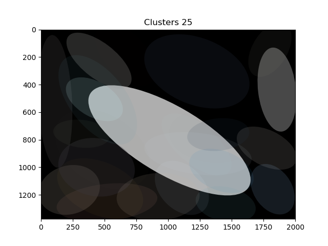
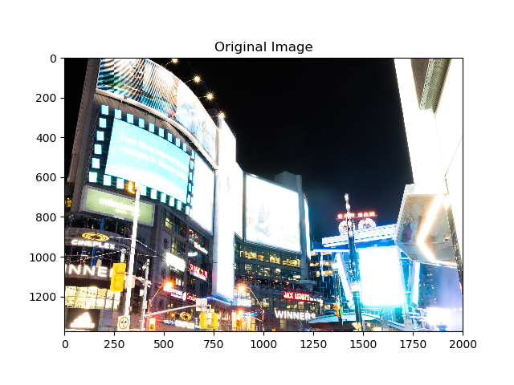
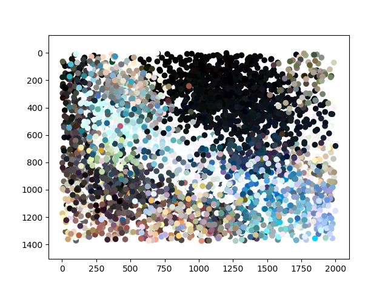
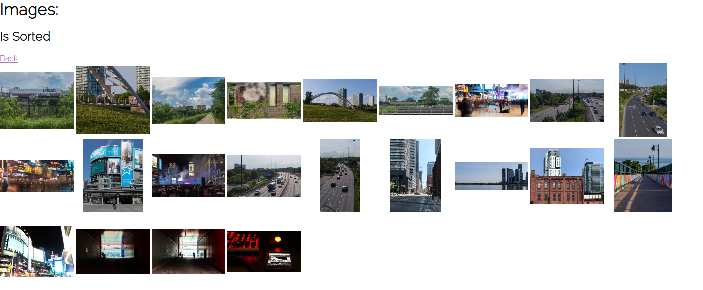
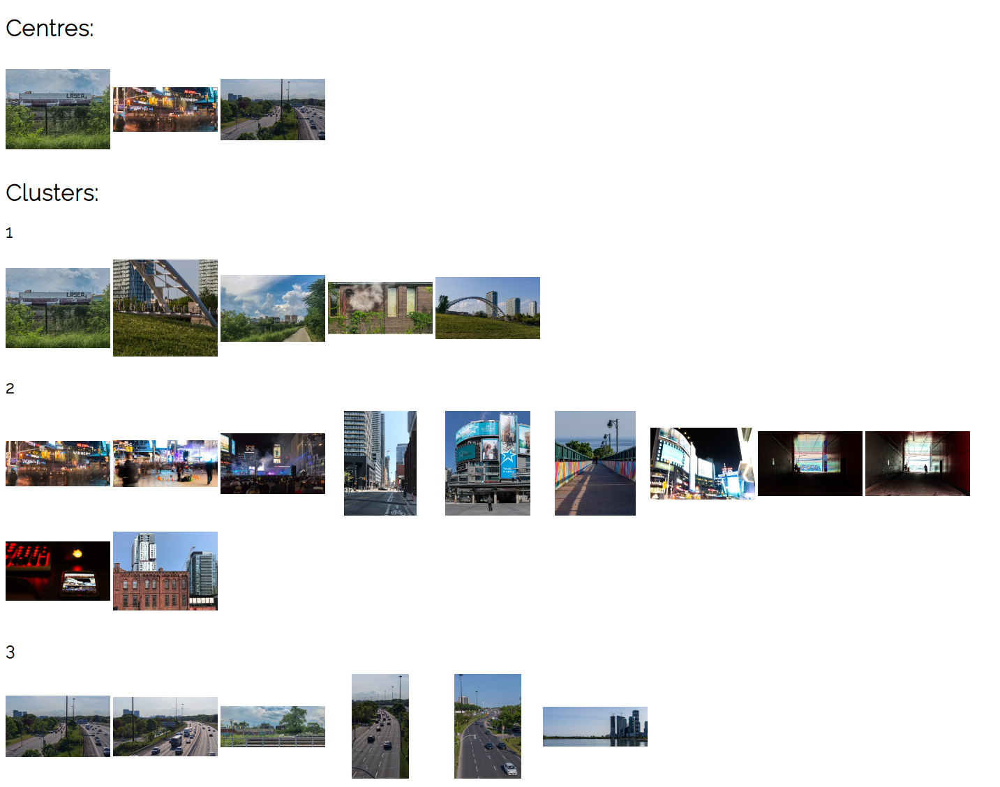

# leitmotiv

Leitmotiv is an application meant to find reoccuring trends in photo
collections.  It also provided a good excuse to learn how variational Gaussian
Mixture Models worked.  The name is an alternate spelling of
"[leitmotif](https://en.wiktionary.org/wiki/leitmotif)", which means a recurring
pattern or motif.

> This is still very much a **work in progress** so there isn't much formal
> documentation beyond this README.  The code itself is heavily commented using
> Numpy-style docstrings.

## Contents

* [What It Does](#what-it-does)
* [Running The App](#running-the-app)
* [Licence](#licence)

## What It Does

At its core, leitmotiv is a effectively an image clustering system.  It
represents images as mixture models that are compared to one another using
Jensen-Shannon divergences.  The JS-divergence has some nice properties, such as
being symmetric divergences, that makes it convenient to use in this
application.  The resulting set of pairwise distances is then partitioned using
[affinity propagation](http://scikit-learn.org/stable/modules/clustering.html#affinity-propagation)
because it can work with distance matrices directly.

The application uses GMMs to represent images because these are *generative*
models.  That means you can pull *new* values from the modelled distribution.
This has some potential applications when it comes to, for example, creating an
"average image" of a set of images.

### Image GMMs

At a high-level, an image is a distribution of 5-dimension vectors, i.e.
`(x,y,r,g,b)`.  That encodes the fact that each spatial location has an
associated colour triplet.  Representing this as a GMM is straightforward and
is a well-known technique.  E.g., grab cuts uses it for modelling
foreground/background colour distributions.  There are usually two complications
when working with images:

1. You don't want to hard-code the resolution so you (somehow) have to be able to
  accept any image of any resolution.
2. The number of clusters in the 5D features space are unknown.

Solving '1' is actually not too difficult.  The key is to scale the feature
vectors ahead of time so that they are zero-mean and unit variance.  This might
seem counter-intuitive but it has the advantage of making the feature vectors
the same "size" regardless of how big the image image.  The scaling itself is
linear and invertible, so it's possible to always go back to the original
feature space.

While it's possible to sample every pixel, the implementation doesn't do that.
This would require quite a bit of time to find the GMM for even a modestly-sized
image.  Instead, the image is first blurred with a Gaussian kernel and then a
fixed number of samples (implementation uses 5000) are taken.  While there is a
loss of detail, the overall image structure is still retained.  The blurring
also removes fine-scale details so that any sample is the actually the average
of a local neighbourhood.

Solving '2' is a bit harder to deal with.  In general, there is no "good" way to
find the correct number of clusters and choosing this number is something that
is done in hyperparameter tuning.  However, some algorithms do not require
knowing the number of clusters ahead of time.  The [variational Bayes GMM algorithm](http://scikit-learn.org/stable/modules/mixture.html#variational-bayesian-gaussian-mixture)
does just that: it can "learn" the number of clusters in the data set. Leitmotiv
has its own implementation of this algorithm, which is from the same source as
Scikit-Learn's (Pattern Recognition and Machine Learning by C. Bishop, 2006).
This allows you to set the *maximum* number of clusters (the implementation
default is 50) without having to worry about choosing the exact number.

When you train the GMM on an image, the output is a mixture model of a 5D
distribution.  For example, the GMM below



was obtained from the image below.



It's much easier to see the connection when you *sample* from the GMM to produce
a new image, which is what's shown below.



### Comparing Images

Once you have a GMM for each image, you can compare images by looking at the
similarities between those GMMs.  Similar images should have similar GMMs.  The
way to compare GMMs is through divergences such as Kullbeck-Leibler or
Jensen-Shannon.  Leitmotiv contains a [Flask-based](http://flask.pocoo.org/)
web interface for exploring these relationships.  Once the server is up and
running, it can be accessed at `localhost:5000` in any browser.


**Ranked Images**

Images are ordered from most to least similar to the selected image (top-left
corner).  The default view shows images ordered by date captured.  Selected an
image will produce a page like the one below.



**Image Clusters**

Images are clustered using [affinity propagation](http://scikit-learn.org/stable/modules/clustering.html#affinity-propagation).
There is currently no link to this page; you have to access it by
`localhost:5000/clusters`.



## Running the App
The recommended way to run leitmotiv is through Docker as it takes care of
managing all of the dependencies.  It is possible to also build it manually
using [Conda environments](https://conda.io/docs/user-guide/concepts.html#conda-environments),
though this is more useful during development.

### Using Docker
Running leitmotiv with docker is straightforward.  First, build the container
with:

```bash
$ sudo docker build -t leitmotiv .
```

Images can be added into the leitmotiv database using the `add-images.sh`
script:

```bash
$ sudo ./scripts/add-images.sh /path/to/images
```

This usually requires passing a full path, e.g. `/home/username/images` since
Docker has to be able to mount the path in read-only mode.  This script may take
a while to run as it is processing all of the images in the provided directory.
The leitmotiv webui is started by

```bash
$ sudo ./scripts/server.sh --start
```

and stopped by

```bash
$ sudo ./scripts/server.sh --stop
```

**Note**: `sudo` is used since this assumes that the current user *is not* part
of the 'docker' group.  Please see the [Docker daemon attack
surface](https://docs.docker.com/engine/security/security/#docker-daemon-attack-surface)
article for details.

### Manually
Running leitmotiv is a bit more difficult because it requires creating a conda
environment followed by a separate `pip install` step.  The reason for this is
that the numerical packages (such as numpy) have optimizations in the conda
builds that aren't necessarily in the wheels available on PyPI.  The Docker
build does the exact same thing internally.

```bash
$ conda env create
$ conda activate leitmotiv
(leitmotiv) $ pip install .   # or `pip install -e .` for editable builds
(leitmotiv) $ leitmotiv --help
Usage: leitmotiv [OPTIONS] COMMAND [ARGS]...

  leitmotiv - Extract Trends from Image Collections

Options:
  -c, --config PATH  Path to application configuration file.
  -d, --debug        Enable all debugging output.
  --help             Show this message and exit.

Commands:
  add-directory  Add one or more directories into the library.
  add-image      Add either a single or multiple images into...
  build-index    Generate the image distance index.
```

## Licence

The source code is licensed under a BSD 3-Clause licence.  Anything in the
[vendor](vendor/) folder may be subject to separate licence.
